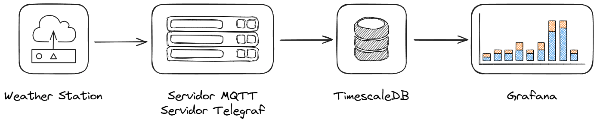

# **Propuesta de Solución: Estación Meteorológica Inteligente con MQTT y TimescaleDB**

## 1. Introducción

El objetivo del proyecto es diseñar una infraestructura que permita **recoger, almacenar y visualizar datos meteorológicos** generados por una estación IoT conectada por cable Ethernet (RJ-45).  
Los datos incluirán variables como temperatura, humedad, presión atmosférica, viento, radiación UV y concentración de partículas en el aire.

Para lograrlo, se propone una arquitectura basada en **comunicación MQTT** y **almacenamiento en base de datos temporal TimescaleDB**, acompañada de un sistema de visualización mediante **Grafana**.

Esta solución combina **eficiencia, escalabilidad y simplicidad**, permitiendo que varias estaciones transmitan información a un mismo servidor de forma continua y segura.

---

## 2. Arquitectura general

La comunicación entre los diferentes componentes se basa en el siguiente esquema:



### Descripción de los componentes

- **Estación meteorológica:** conectada por Ethernet, recoge y envía datos cada pocos segundos mediante MQTT.  
- **Servidor MQTT (Mosquitto):** recibe los mensajes de las estaciones y los distribuye a los servicios que los necesiten.  
- **Servicio de ingesta (Telegraf):** transforma los datos y los guarda automáticamente en la base de datos.  
- **Base de datos TimescaleDB:** extensión de PostgreSQL optimizada para datos con marca de tiempo.  
- **Grafana:** muestra los datos en gráficos y paneles actualizados en tiempo real.

---

## 3. Explicación breve de las herramientas

| Herramienta | Descripción | Rol en el proyecto |
|--------------|-------------|--------------------|
| **MQTT** | Protocolo de mensajería ligero diseñado para IoT. Usa el modelo “publicar–suscribirse”. | Permite que las estaciones envíen sus mediciones al servidor de forma continua y fiable. |
| **Mosquitto** | Servidor (broker) MQTT gratuito y de código abierto. | Recibe los datos de las estaciones y los pone a disposición de otros servicios, como Telegraf. |
| **Telegraf** | Agente de recopilación y envío de métricas desarrollado por InfluxData. | Escucha los datos del broker MQTT, los formatea y los inserta en la base de datos. |
| **TimescaleDB** | Base de datos de series temporales basada en PostgreSQL. | Almacena eficientemente millones de registros con marcas de tiempo. |
| **Grafana** | Plataforma web de visualización y paneles de control. | Permite analizar los datos en tiempo real con gráficos interactivos. |
| **Docker** | Plataforma para ejecutar servicios en contenedores aislados. | Simplifica la instalación, despliegue y mantenimiento del sistema. |

---

## 4. Flujo de datos

1. Cada estación mide variables como temperatura, humedad y presión.  
2. Envía un mensaje en formato **JSON** al servidor MQTT.  
3. El servidor MQTT reenvía los datos al servicio **Telegraf**.  
4. Telegraf inserta los datos en la base de datos **TimescaleDB**.  
5. Grafana los muestra en gráficos **actualizados al instante**.

**Ejemplo de mensaje JSON:**
```json
{
  "station_id": "meteo-001",
  "ts": 1730545200000,
  "temp_c": 22.4,
  "hum_pct": 55.3
}
```

---

## 5. Ventajas de la solución

### Eficiencia
- MQTT usa poco ancho de banda, ideal para dispositivos pequeños y redes con recursos limitados.  
- Los datos se procesan en segundos y se almacenan automáticamente sin intervención manual.

### Escalabilidad
- La infraestructura puede crecer fácilmente de **una sola estación** a **miles** sin necesidad de grandes cambios.  
- Varios servicios pueden ejecutarse en paralelo para repartir la carga.

### Fiabilidad
- Los datos no se pierden si la conexión se interrumpe: el sistema reintenta el envío automáticamente.  
- La base de datos TimescaleDB garantiza integridad, compresión y retención controlada de los datos antiguos.

### Visualización inmediata
- Grafana permite observar el clima en tiempo real, detectar patrones y comparar estaciones.  
- Se pueden configurar alertas automáticas ante valores fuera de rango (por ejemplo, exceso de radiación UV o contaminación).

---

## 6. Infraestructura recomendada

- **Servidor local o en la nube** con Docker (mínimo 4 núcleos, 8 GB de RAM).  
- **Servicios instalados:**
  - Mosquitto (broker MQTT)  
  - Telegraf (ingesta de datos)  
  - TimescaleDB (base de datos)  
  - Grafana (visualización)

Todos los servicios se ejecutan en contenedores **Docker**, lo que simplifica la instalación y el mantenimiento.  
La estación solo necesita conocer la **dirección IP del servidor** y el **puerto MQTT** para enviar sus datos.

---

## 7. Conclusión

La arquitectura propuesta basada en **MQTT + TimescaleDB + Grafana** ofrece una **solución moderna, eficiente y escalable** para la gestión de datos meteorológicos en proyectos de Internet de las Cosas (IoT).

Permite recibir datos en tiempo real, almacenarlos de forma organizada y analizarlos visualmente desde cualquier navegador.  
Su diseño modular y abierto facilita tanto el aprendizaje como futuras ampliaciones del sistema.
